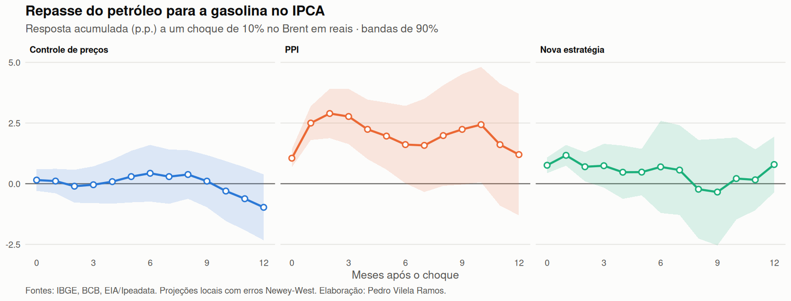
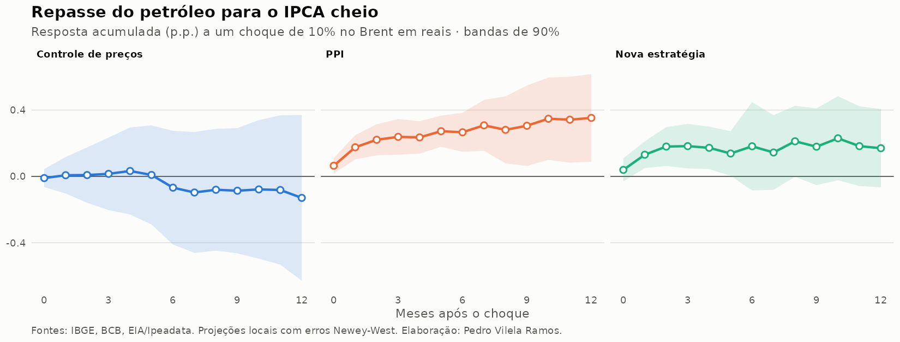

# Repasse do petróleo para a gasolina e para o IPCA

**Pergunta:** quanto de um choque no preço internacional do petróleo chega à
gasolina na bomba e à inflação brasileira, e como isso mudou com a política de
preços da Petrobras?




➡️ **Tabela de resultados: [`resultados/resumo.md`](resultados/resumo.md)**

## Por que isso importa

A gasolina pesa cerca de 5% do IPCA e é um preço que responde a decisões da
Petrobras. Entre outubro de 2016 e maio de 2023, a empresa seguiu o **Preço de
Paridade de Importação (PPI)**, acompanhando o petróleo e o câmbio. Antes, os
preços eram represados; depois de maio de 2023, a nova estratégia comercial
passou a suavizar os repasses. A pergunta tem implicação direta para a
política monetária: quanto maior o repasse, maior a volatilidade da inflação
cheia e mais relevante o choque de oferta nas decisões do Copom.

## Estratégia empírica

**Choque:** variação mensal do Brent convertido em reais (Brent em US$ × câmbio).
Para um país tomador de preço como o Brasil, o petróleo internacional é
exógeno à inflação doméstica.

**Projeções locais** (Jordà, 2005), com um coeficiente para cada regime:

$$
y_{t+h} - y_{t-1} = \sum_{r} \beta_{h}^{r}\, \text{choque}_t \cdot \mathbb{1}[\text{regime}_t = r]
+ \sum_{l=1}^{3}\left(\phi_l\, \text{choque}_{t-l} + \theta_l\, \Delta y_{t-l}\right)
+ \text{mês} + \text{tributos} + \varepsilon_{t+h}
$$

- $y$: log do índice (×100) do IPCA-gasolina ou do IPCA cheio
- $\beta_h^r$: repasse acumulado em $h$ meses no regime $r$
- Regimes: **controle de preços** (até set/2016), **PPI** (out/2016 a abr/2023),
  **nova estratégia** (desde mai/2023)
- Controles para mudanças tributárias: greve dos caminhoneiros (jun/2018),
  teto do ICMS (jul e ago/2022) e reoneração federal (mar/2023)
- Erros-padrão Newey-West com $h+1$ defasagens; bandas de 90%

**Decomposição:** o efeito direto no IPCA é o repasse para a gasolina vezes
o peso da gasolina no índice. A diferença para a resposta do IPCA cheio
estima os efeitos indiretos (frete, passagens, outros bens).

## Dados

| Série | Fonte |
|---|---|
| IPCA e IPCA-gasolina: variação mensal e peso | IBGE/SIDRA, tabelas 2938, 1419 e 7060 |
| Câmbio R$/US$ (PTAX venda, média mensal) | BCB/SGS, série 1 |
| Brent (US$/barril, média mensal da diária) | EIA, via Ipeadata (`EIA366_PBRENT366`); reserva: FMI via FRED |

Amostra: julho de 2006 em diante.

## Como rodar

```r
install.packages(c("jsonlite", "sandwich", "lmtest", "ggplot2"))
```

```bash
Rscript run.R             # baixa os dados e estima
Rscript run.R --offline   # reusa data/processado/base_mensal.csv
Rscript tests/test_lp.R   # teste com dados simulados
```

O GitHub Actions ([`.github/workflows/rodar.yml`](.github/workflows/rodar.yml))
reestima tudo no dia 20 de cada mês.

## Estrutura

```
├── R/
│   ├── dados.R      # coleta (SIDRA, SGS, FRED)
│   ├── lp.R         # projeções locais por regime
│   └── graficos.R   # figuras e tabela
├── run.R            # roda tudo
├── tests/test_lp.R  # teste com dados simulados
├── data/processado/
├── figures/
└── resultados/
```

## Limitações e próximos passos

- O Brent em reais é uma aproximação do custo de importação. O ideal é usar o
  preço de realização da Petrobras nas refinarias (ANP), que isola a decisão
  da empresa do resto da cadeia (distribuição, revenda, etanol anidro).
- O regime "nova estratégia" ainda tem poucas observações, e as bandas são largas.
- Extensões: diesel e seus efeitos via frete; assimetria entre altas e quedas
  (*rockets and feathers*); repasse para as expectativas do Focus.

## Referências

- Jordà, Ò. (2005). *Estimation and inference of impulse responses by local projections*. AER.
- Ramey, V. (2016). *Macroeconomic shocks and their propagation*. Handbook of Macroeconomics.
- Banco Central do Brasil. Boxes do Relatório de Inflação sobre repasse de preços de combustíveis.

---

Pedro Vilela Ramos · Economia (IE/UFRJ)
